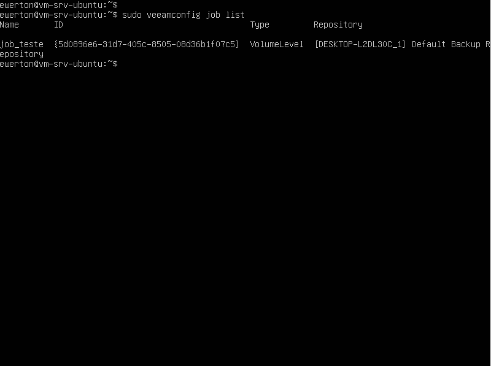
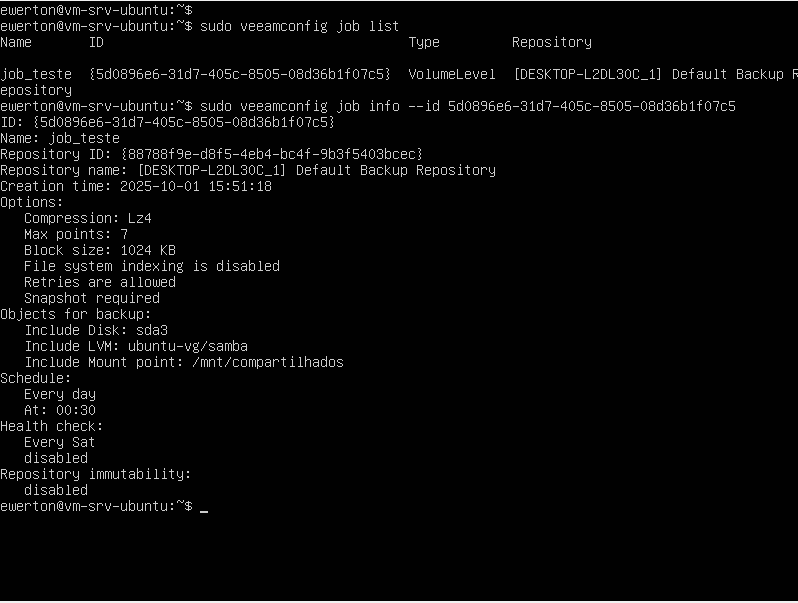

FAZENDO BACKUP DA PARTIÇÃO DO UBUNTU

Com o veeam agent instalado no linux, é possível fazer os backups do sistema operacional conforme a necessidade do usuario. Pode ser feito o backup do SO por completo, de um diretório ou partição. No homelab em questão, será feito o backup da partição sd3 que contém um volume logico para o armazenamento dos arquivos utilizando o serviço samba para criar a comunicação com o host (Windows) e a vm (Linux) no virtualbox. Para começar iniciar todo esse processo, primeiro é criado um job de backup.
Como anteriormente já havia sido criado um job, porém era referente a todo o sistema operacional, e esse não é o objetivo. Esse job será apagado e criado um novo.

-sudo veeamconfig job delete --id {id_do_job}

-sudo veeam #Criar um novo job

Com o comando "sudo veeam" é aberto uma interface onde dev ser inseridas as infomações do job que está sendo criado. Nesse homelab, o nome do backup será "jobe_test", o destino será o repositório padrão, que é o veeam B&R do windows e será feito o backup da partição sd3, como informado anteriormente. 

com o job criado, iremos listar ele na linha de comando do Linux para ver algumas informações necessárias.

- sudo veeamconfig job list

Com o id informado pelo job list, pode ser usado para ver informações mais detalhadas sobre o job criado. 

-sudo veeamconfig job info --id <ID_DO_JOB>

Já foi identificado o id do job, suas informações principais como:

O que vai ser feito o backup: Volume da partição sd3
Hora do backup: 00:30
Local do backup: Default Backup repository

Sendo assim, pode se inciar o backup da partição em questão, mesmo já tendo um horário configurado como padrão.

-sudo veeamconfig job strat -name job_teste

Na imagem mostra que o backup foi executado com sucesso e foi gerado logs do backup. 

Agora, é possível ir no veeam B&R e localizar o backup da máquina. 

home -> Backups -> disk

Restore guest files -> linux and other 

Informe as credenciais da máquina

E agora, acesso permitido ao backup feito. 

