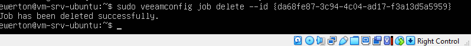
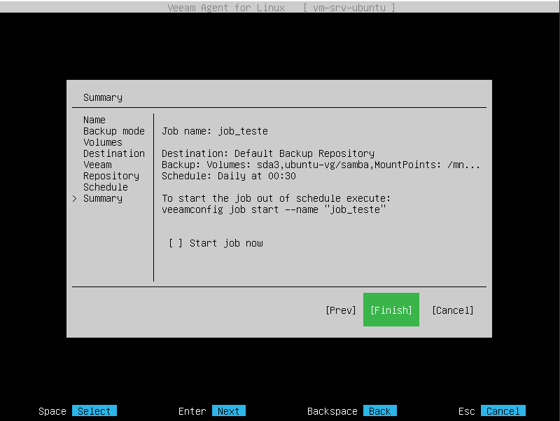
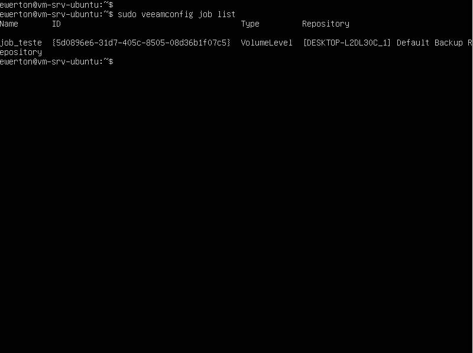
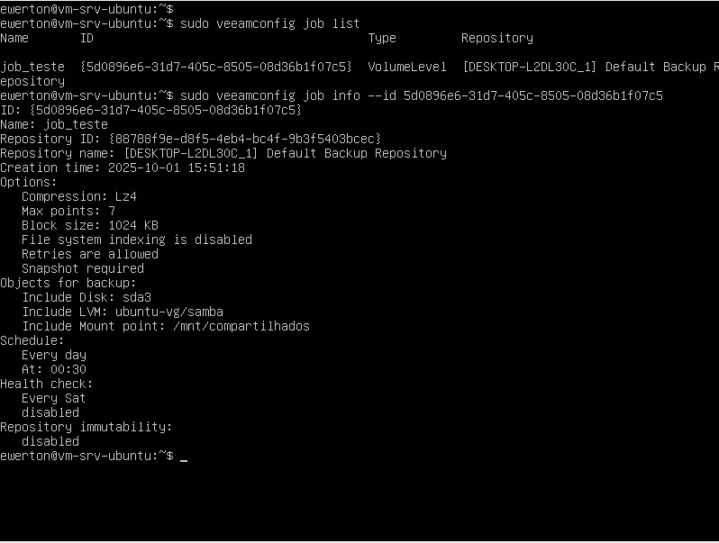
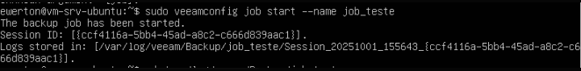
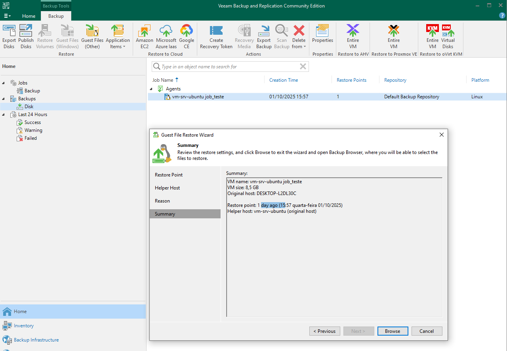
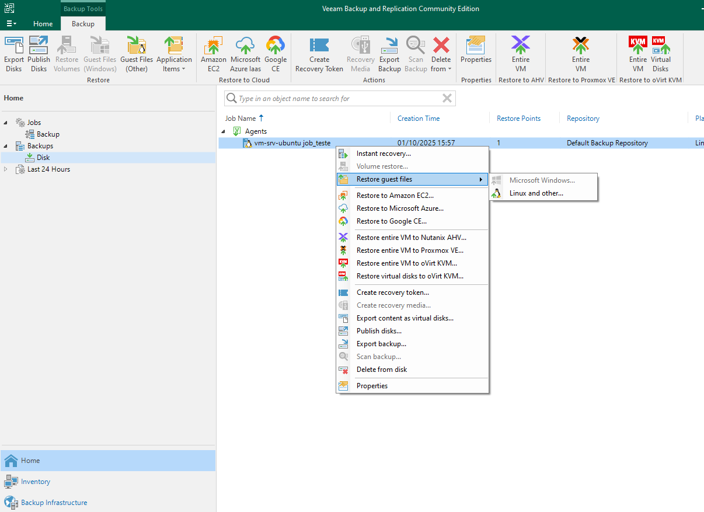
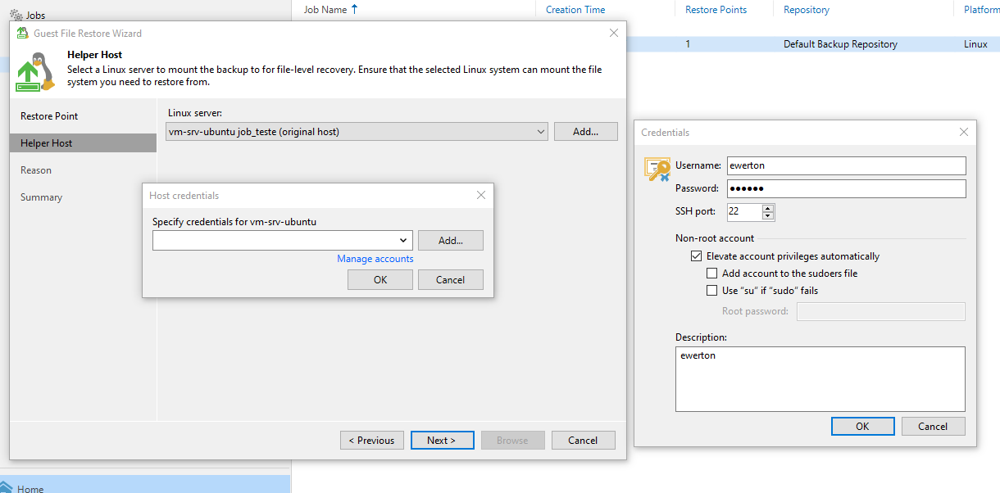
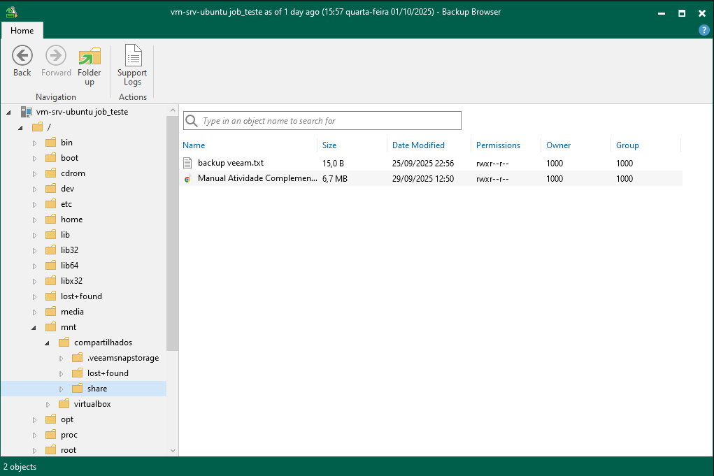

FAZENDO BACKUP DA PARTIÇÃO DO UBUNTU

Com o Veeam Agent instalado no Linux, é possível realizar backups do sistema operacional conforme a necessidade do usuário. O backup pode abranger todo o sistema operacional, apenas um diretório ou uma partição específica.

No homelab em questão, será executado o backup da partição sd3, que contém um volume lógico destinado ao armazenamento de arquivos. Para estabelecer a comunicação entre o host (Windows) e a máquina virtual (Linux) no VirtualBox, é utilizado o serviço Samba.

Para iniciar esse processo, é necessário criar um job de backup.

Como anteriormente já havia sido criado um job referente ao backup completo do sistema operacional, e esse não é o objetivo, o job existente será excluído e um novo será criado.

-sudo veeamconfig job delete --id {id_do_job}

-sudo veeam   # Criar um novo job

Ao executar o comando sudo veeam, é aberta uma interface na qual devem ser inseridas as informações do job que está sendo criado. Neste homelab, o nome definido para o backup será job_teste, o destino será o repositório padrão (Veeam Backup & Replication do Windows) e o escopo do backup será a partição sd3, conforme informado anteriormente.

Com o job criado, iremos listá-lo na linha de comando do Linux para obter algumas informações necessárias.

- sudo veeamconfig job list

Com o ID informado pelo job list, é possível consultar informações mais detalhadas sobre o job criado.

-sudo veeamconfig job info --id <ID_DO_JOB>

As informações principais do job identificado são:

Volume configurado para backup: partição sd3

Horário do backup: 00:30

Local de destino: Default Backup Repository

Com esses parâmetros confirmados, é possível iniciar o backup da partição em questão, mesmo que já exista um agendamento configurado.

-sudo veeamconfig job start --name job_teste

Na execução, observa-se que o backup foi realizado com sucesso e que os logs foram devidamente gerados.

Em seguida, é possível acessar o Veeam Backup & Replication (Windows) e localizar o backup da máquina em:

home -> Backups -> disk

Para restaurar arquivos da máquina Linux:

Restore guest files -> Linux and other

Será solicitado o fornecimento das credenciais da máquina.

Uma vez informadas corretamente, o acesso ao backup é concedido.

