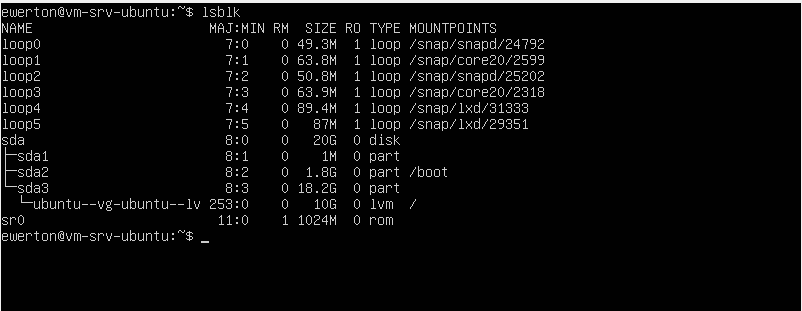
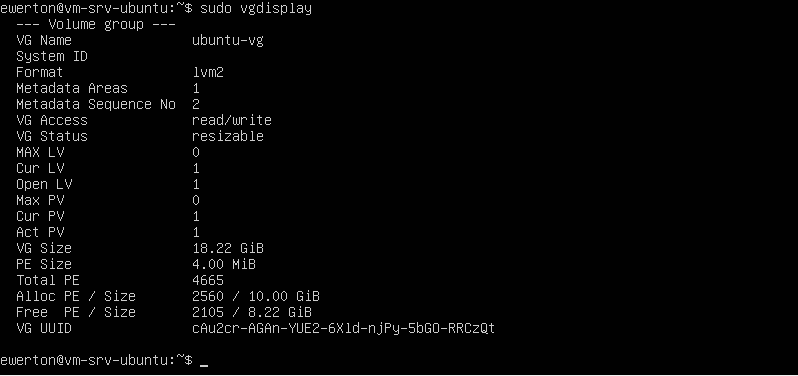
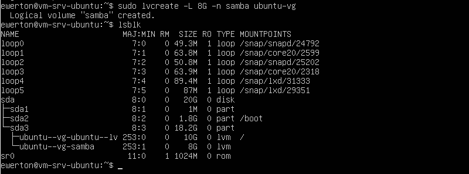
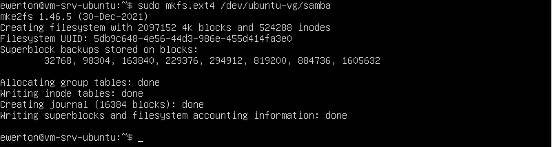
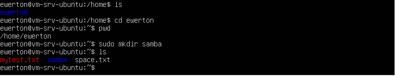
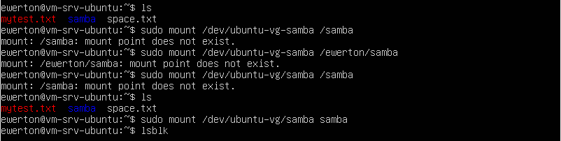
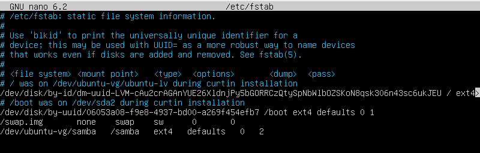
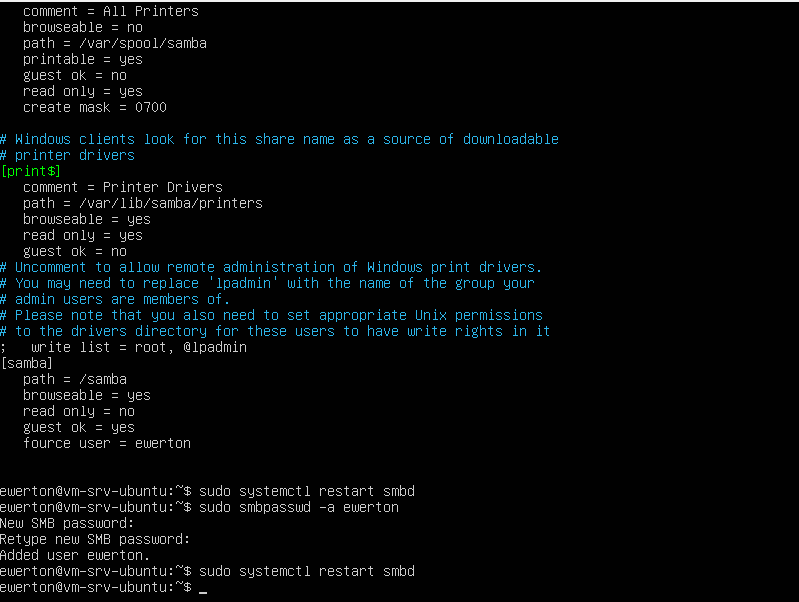
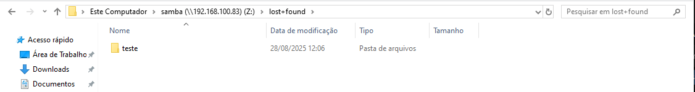
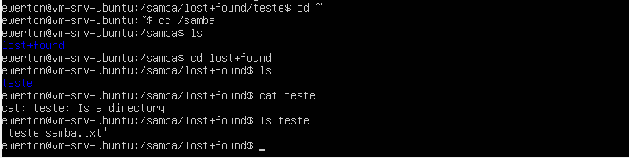

CRIANDO VOLUME NO SISTEMA LVM E UTILIZANDO O SAMBA PARA COMPARTILHAR DADOS COM WINDOWS

1. Verificação das partições existentes

Antes de qualquer configuração, é importante verificar como está a organização dos discos e partições no Ubuntu.

-lsblk

-> Conforme a imagem, o sda possui três partições:

sda1 - partição de reserva do sistema.

sda2 (1.8G) - montada em /boot, contendo os arquivos essenciais para inicialização do SO.

sda3 - montada no diretório raiz /, já configurada como LVM.

Dentro do LVM, pode-se observar que 10GB estão alocados para ubuntu--vg-ubuntu--lv, responsável pelo diretório raiz.

2. Verificação do espaço disponível no Volume Group

Para verificar quanto espaço livre existe no VG (Volume Group):

-sudo vgdisplay

-> Nesse exemplo, existem 8.22 GB livres para criação de novos volumes lógicos.

3. Criação do volume lógico para Samba.

-sudo lvcreate -L 8G -n samba ubuntu-vg

-L 8G → define o tamanho do volume.

-n samba → nome do volume lógico.

ubuntu-vg → nome do Volume Group.

4. Formatação do volume
sudo mkfs.ext4 /dev/ubuntu-vg/samba

-> Volume formatado em ext4 para uso.

5. Criação e montagem do ponto de montagem

Criação do diretório:

-sudo mkdir /samba

Montagem do volume:

-sudo mount /dev/ubuntu-vg/samba /samba

⚠️ Erros podem ocorrer se o argumento final for escrito incorretamente (exemplo: /samba vs samba). Foi o que aconteceu na hora de de montar o volume lógico, pois o usuario já estava no diretório que possui o diretório "samba". Nessa situação, não é necessário colocar o / que serve como caminho, caso esteja fora do diretório em questão. 

6. Configuração de montagem persistente

Sem configuração persistente, após reinicializações o diretório /samba ficará vazio. Para corrigir:

-sudo nano /etc/fstab

Adicionar a seguinte linha:

/dev/ubuntu-vg/samba   /samba   ext4   defaults   0   2

7. Instalação e configuração do Samba

Atualizar repositório e instalar o pacote:

sudo apt update
sudo apt install samba -y

Editar o arquivo de configuração:

sudo nano /etc/samba/smb.conf

Adicionar o bloco:

[samba]
   path = /samba
   browseable = yes
   read only = no
   guest ok = yes
   force user = ewerton

   
   
8. Permissões do diretório compartilhado

Dar as permissões corretas para o usuário:

sudo chown -R ewerton:ewerton /samba
sudo chmod -R 0775 /samba

9. Acesso no Windows

Na barra de endereços do Windows Explorer, digitar:

\\192.168.100.83\samba

Será solicitado usuário e senha:

Usuário: ewerton

Senha: (definida no smbpasswd)

Após autenticação, a pasta aparecerá como rede no Windows.
É possível também mapear o compartilhamento como um disco de rede.

Mapeamento:

10. Verificação no Ubuntu

Após salvar arquivos pelo Windows, eles estarão disponíveis em:

ls -l /samba

Observação importante

O diretório lost+found aparece porque /samba é o ponto de montagem de um volume ext4.

Normalmente, ao criar compartilhamentos Samba em diretórios comuns, esse item não aparece.

Para organização, é recomendável criar subpastas em /samba, por exemplo:

sudo mkdir /samba/compartilhado
sudo chown -R ewerton:ewerton /samba/compartilhado

E no smb.conf, alterar para:

path = /samba/compartilhado

Dificuldades encontradas:

Erros de escrita no comando de montagem.

Confusão entre caminhos relativos (samba) e absolutos (/samba).

Permissões rigorosas no Linux, que bloquearam escrita até serem ajustadas.

Diferenças de comportamento no Windows (descoberta de rede, credenciais salvas automaticamente).

Essas dificuldades reforçam a importância da prática, pois a integração entre Linux e Windows exige atenção aos detalhes para garantir uma boa experiência de uso.

