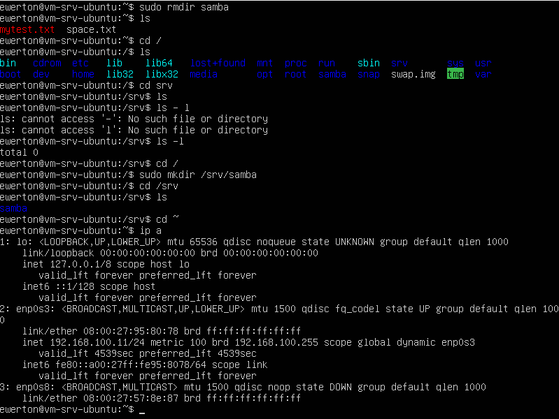
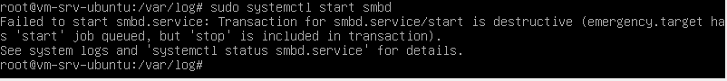
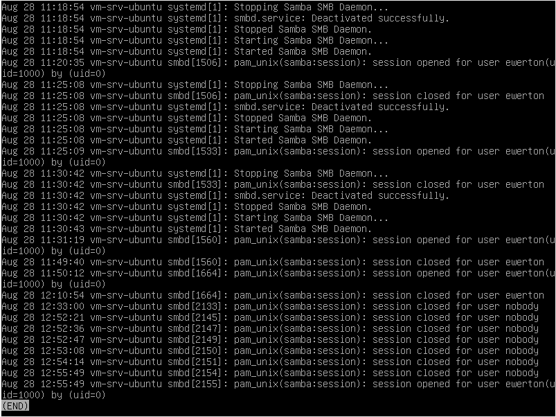
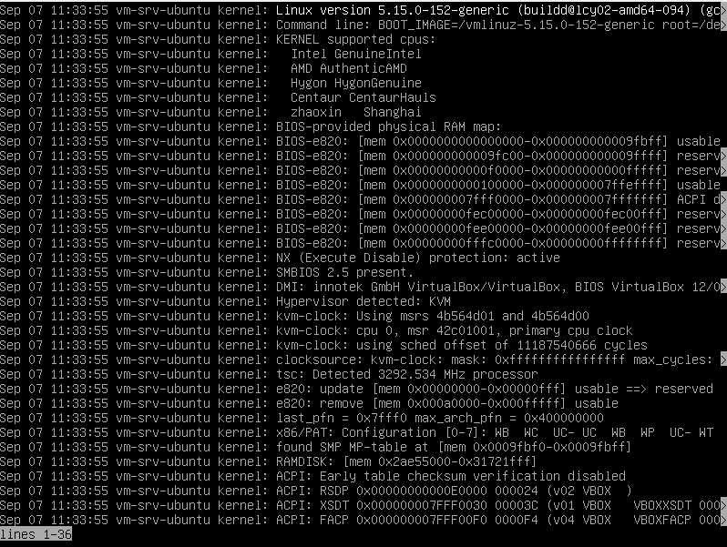

RESOLVENDO ESTADO DE EMERGÊNCIA UBUNTU 

Ao iniciar o Ubuntu, foi identificado que o sistema foi aberto como usuário root, o que não é o normal de acontecer. A princípio não foi identificado nenhum problema. 
Porém, na hora de utilizar o Samba, que é o software utilizado para fazer a comunicação entre o Linux e o Windows, o Windows não conseguiu mapear o caminho que foi configurado anteriormente. 
O primeiro problema identificado foi que o Ubuntu não estava na mesma rede que o host. A interface 1 (lo) é a de loopback, a interface 2 (enp0s3) é a que faz a comunicação interna com o pfsense e a interface 3 (enps0s8) estava vazia. Após usar o comando "sudo dhclient', a interface 3 passou a receber IP. 

Mas mesmo a interface obtendo IP, o mapeamento continuou indisponível. O erro que foi mostrado era de “caminho já está sendo utilizado”. Normalmente quando isso acontece, é porque o sistema operacional já tem uma sessão ativa com o mesmo servidor .No Prompt de comando do Windows, foi utilizado alguns comandos para verificar o motivo do não funcionamento do serviço. 

-net use: Vai listar todas as conexões SMB ativas.

A princípio a conexão estava desativada.

-net use * /delete: Desconecte a sessão antiga

Comando usado apenas para validar de fato a desconexão com o servidor. 

Após a execução desses comandos, foi feita a tentativa de mapear o Linux, porém sem sucesso também. 

Com isso, foi feita uma verificação no serviço Samba para ver se ele estava funcionando de fato. Foi utilizado alguns comandos nesse processo.

-systemctl status smbd

Esse comando me mostrou que o serviço não estava rondando 

Conforme a imagem abaixo, ao tentar executar o “systemctl start smbd” após verificar que o sistema não estava rodando. O sistema emitiu a seguinte mensagem: 

“Failed to start smbd.service: Transaction for smbd.service/start is destructive (emergency.target has 'start' job queued, but 'stop' is included in transaction).”

Nesse caso, ele quis dizer que o systemd do sistema operacional está em modo crítico. E isso já esclarece o porque o sistema inicializou como root e o serviço não está rodando. Foi executado um “systemctl status apache2” para verificar um outro serviço e também não estava rodando. 

Também foi feita uma analise os logs do serviço para identificar se existia algum comportamento suspeito. 

O que pode ser observado na imagem acima é que a última execução do serviço foi no dia 28 de Agosto. Também foi executado alguns comandos para verificar qual é o alvo de inicialização do sistema 

-systemctl get-default: Emite qual o modo atual do sistema

Nesse caso, o sistema emitiu o "graphical.target"

-systemctl list-units --type=target: exibe todos os modos do systemd 

Foi realizado a tentativa de sair do modo emergência e colocar o sistema em modo de multi usuário com o seguinte comando: 

-sudo systemctl isolate multi-user.target 

Mesmo assim, a informação emitida foi a mesma: 

“Failed to start smbd.service: Transaction for smbd.service/start is destructive (emergency.target has 'start' job queued, but 'stop' is included in transaction).”

Analisando os logs novamente, mas utilizando um outro comando.

-journalctl -xeu smbd

Esse comando emitiu a mensagem “No entries”. Com esse resultado observamos que o serviço nem foi iniciado. Essa foi só uma outra forma de validar a não funcionalidade do serviço. 

Validado também se o binário “smbd” existe.

-which smbd

Resultado do comando:

“/usr/sbin/smbd”

Nesse caso, o arquivo smbd segue o caminho correto.

Listando os serviços disponiveis 

-systemctl list-unit-files | grep smb
-systemctl list-unit-files | grep samba

Esses comandos trouxeram na saída do CLI serviços do Samba. Verificado também que os serviços são existentes.

Até aqui, foi diagnosticado as seguintes situações:

-O binário smbd existe em /usr/sbin/smbd.
-O systemd enxerga o smbd.service (está até enabled).
-Mas quando você roda systemctl start smbd, ele não sobe e também não gera log.
-Systemd se encontra em estado crítico e com isso, inicializou em modo root e não permite alterações do sistema.

Após algumas pesquisas foi entendido que o sistema possivelmente está corrompido, e por isso aconteceu todos esses comportamentos. O sistema só voltará ao normal depois que for identificado o que está causando o problema. Então nessas situações, o objetivo dele é manter o sistema seguro sem que o usuário cause mais danos, Entretanto, o sistema monta a partição raiz (/) em modo somente leitura (read-only), por isso não estava sendo possível fazer alterações no sistema.

Como foi de entendimento que pode ser algo que está corrompendo o sistema, e por isso esse comportamento. Foi analisando o log de inicialização do sistema para ver se ocorreu algum erro que possa dar uma pista do que aconteceu.

-journalctl -xb

